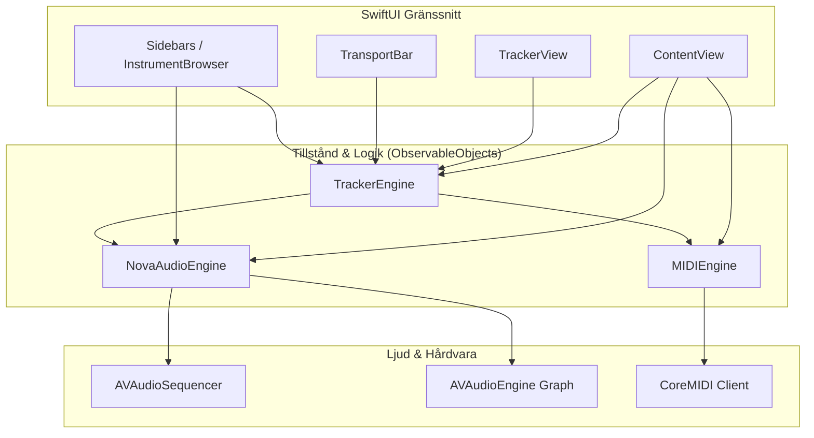
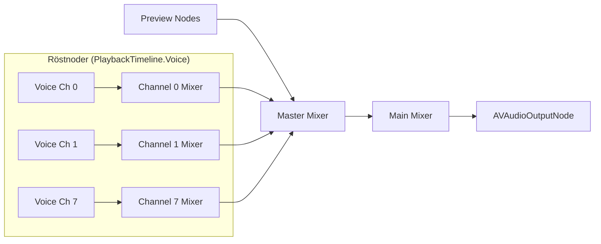

# Teknisk Arkitektur — RetroTrakk

Detta dokument beskriver systemarkitekturen, datamodellen, ljudgrafen, timingmodellen och de tekniska principerna för RetroTrakk. Det är skrivet för att vilken utvecklare eller AI-modell som helst ska kunna förstå systemet på djupet och genomföra vidareutveckling utan regressionsfel.

---

## 1. Övergripande Systemarkitektur

Applikationen är uppbyggd i tre primära lager:

* **`RetroTrakkApp`**: Registrerar och injicerar tre centrala `ObservableObject`:
  1. `NovaAudioEngine`: Ljudgraf, sequencertillstånd, nodhantering och rendering.
  2. `MIDIEngine`: CoreMIDI-ingångar, enhetsanslutning och paketparsning.
  3. `TrackerEngine`: Spelpositionskoordinator, tangentbordslogik, markering och redigering.

---

## 2. Datamodell (`SongModel.swift`)

All data för en låt sparas som ett monolitiskt, serialiserbart JSON-dokument (`SongModel`).

### Datatyper

* **`TrackerCell`**:
  * `note`: `UInt8` (0–127 = standard MIDI-not; `254` = Note Off `===`; `255` = Tom cell `---`).
  * `instrument`: `UInt8` (0 = inget valt instrument; 1–255 = 1-baserat index i `song.instruments`).
  * `volume`: `UInt8` (0–64 = volym; `255` = ingen explicit volymsättning, standard 100 velocity).
  * `effect` & `param`: `UInt8` (reserverade för tracker-effekter såsom arpeggio, pitch slide etc.).
* **`PatternModel`**:
  * Representerar ett mönster. Standard är 64 rader och 8 kanaler (`cells[row][channel]`).
* **`SongModel`**:
  * `bpm`: `Double` (standard 125).
  * `stepsPerBeat`: `Int` (1, 2, 4 eller 8; styr kvantisering och metrik).
  * `patterns`: `[PatternModel]`.
  * `orders`: `[Int]` (ordningsföljd av mönster-ID:n under uppspelning).
  * `instruments`: `[InstrumentModel]`.
  * Kanalstatusar: `channelInstruments`, `channelVolume`, `channelPan`, `channelMute`, `channelSolo`, `channelEnabled`.

### `PlaybackTimeline` (Sanningen för timing)
För att garantera musikalisk stabilitet finns det **en enda källa till sanning för uppspelning**: `PlaybackTimeline`.
* `PlaybackTimeline` beräknar utifrån `SongModel` en lista av `Note`-objekt med exakt position i musikaliska taktslag (`beat: Double`) och längd (`duration: Double`).
* Tangenttryckstider i realtid och UI-positioner påverkar aldrig den beräknade tidslinjen.
* Omvandlar `(order, row)` <--> `beat` exakt, även över mönsterövergångar och med patterns av olika radlängder.

---

## 3. Ljudmotor & Nodgraf (`NovaAudioEngine.swift`)

Ljudmotorn bygger på `AVAudioEngine` och kopplas enligt följande graf:

### Separata röstnoder (`PlaybackTimeline.Voice`)
* En röst identifieras av kombinationen `(channel: Int, instrumentID: Int)`.
* **Varför?** Varje kombination av tracker-kanal och instrument har en egen dedikerad ljudnod. Detta förhindrar att en kanal klipper toner från en annan kanal, och säkerställer att kanalernas mixer (volym, pan, mute, solo) verkar på rätt ljudflöde.
* Förhandslyssning (*preview*) har separata egna instanser så att provspelning i gränssnittet aldrig avbryter eller klipper pågående sekvensnoter.

### `AVAudioSequencer` vs UI Timer
* **Sekvensering sker inte via timers i Swift.** `AVAudioSequencer` schemalägger MIDI-händelser i Core Audio-hårdvarans realtidsklocka baserat på taktslag (`AVBeatRange`).
* UI-uppdateringen körs av en 30 Hz timer på Main RunLoop (`TrackerEngine.updatePlayhead()`) som läser av `sequencer.currentPositionInBeats`. Om UI-tråden blockeras fortsätter ljudet spela med mikrosekunders precision utan drift.
* Ändring av BPM under uppspelning ändrar `sequencer.rate` direkt i realtid utan att starta om eller bygga om grafen.

### Instrumenttyper & Staging Graph
1. **`.dls`**: `Apple DLSMusicDevice` (General MIDI). Snabb och garanterat tillgänglig på alla macOS-installationer. Trummor styrs genom `midiChannel = 9` (kanal 10).
2. **`.sample` / `.auSampler`**: `AVAudioUnitSampler`. Laddar WAV/AIFF direkt eller `.exs` / `.aupreset`.
   * **Staging Graph-mönstret:** För EXS-instrument kräver macOS att samplern är ansluten till en aktiv graf vid anropet `loadInstrument(at:)`. För att undvika att UI låser sig skapas en temporär *staging graph* på en bakgrundstråd (`loader` DispatchQueue), varpå den fullt laddade noden flyttas in i den aktiva ljudgrafen på Main Thread.
3. **`.audioUnit`**: Tredjeparts AU MusicDevice skannas via `AudioUnitManager` (`kAudioUnitType_MusicDevice`).

### Offline WAV-rendering (`renderToWAV`)
* Använder `AVAudioEngine.enableManualRenderingMode(.offline)`.
* Renderar till 16-bit 44.1 kHz PCM.
* Renderar händelsestyrt: Renderblocket avslutas vid nästa MIDI-händelsegräns snarare än att tvinga fram 4096-sample block som kan förskjuta notstarter.

---

## 4. Inmatning, MIDI och Redigering (`TrackerEngine.swift`)

### Tangentbordsinmatning (Mac)
* Två-oktavs pianomappning:
  * Nedre oktav: `Z S X D C V G B H N J M ,`
  * Övre oktav: `Q 2 W 3 E R 5 T 6 Y 7 U I`
* **Ackordsfönster:** Snabba anslag (< halva radtiden, max 60 ms) tolkas som ackord och sprids automatiskt till nästa lediga kanal till höger på samma rad.
* **Dublettfilter:** Samma not inom 10 ms sväljs som tangentstuds.

### MIDI Step Input & Texture-läge
* Vid staccato-spel fungerar MIDI-step precis som klassisk tracker-inmatning.
* Vid överlappande nedtryckta tangenter (ackord) hålls cursorn kvar på samma rad och sprider noterna över lediga kanaler. Cursorn flyttas framåt med `stepSize` först när samtliga tangenter i anslaget har släppts (*release-styrd*).

### Live Recording
* När `isRecording == true` och `isPlaying == true` spelas inkommande MIDI direkt in i det aktiva mönstret.
* Kvantisering (`quantize == true`) beräknar närmaste rad i takten baserat på `stepsPerBeat`, även om anslaget sker precis före ett mönsterbyte.

### Markering och Urklipp
* Stödjer gummibandsmarkering med musen (`selAnchor`, `selCursor`) samt Shift+Klick / Shift+Piltangenter.
* Kopiering och inklistring (`copySelection`, `cutSelection`, `paste`) hanterar flerkanaliga och flerradiga block (`[[TrackerCell]]`).

---

## 5. UI-prestanda och Regler (`TrackerView.swift`)

Trackern visar 64 rader gånger 8 kanaler = 512 celler per mönster. För att hålla 60/120 fps på Apple Silicon tillämpas följande regler:

1. **Inga individuella `GeometryReader` per cell:**
   * Tidigare implementation hade 512 `GeometryReader`-instanser vilket överbelastade SwiftUI:s layoutmotor.
   * Nu används en fast radhöjd (`trackerRowHeight = 26`) och en enda `GeometryReader` för hela rutnätet. All hit-testing för musklick och markering beräknas med ren aritmetik.
2. **LazyVStack och sidvis scrollning:**
   * Rutnätet ligger i en `LazyVStack` inuti en `ScrollView`.
   * Vid uppspelning triggas `proxy.scrollTo` endast var 8:e rad för att undvika överflödig scroll-layout.
3. **Fokus och kortkommandon:**
   * `TrackerView` tar emot tangenttryckningar via `.onKeyPress` och kräver fokus (`focused = true`).

---

## 6. Kända Eigenheter & Skyddsåtgärder (Gotchas)

1. **Core Audio `paramErr` på tomma spår:**
   * Anrop av `AVMusicTrack.clearEvents()` på ett spår som aldrig har haft händelser tillagda ger `paramErr` från Core Audio. Koden kontrollerar därför `populated.contains(key)` innan rensning sker.
2. **Externa diskar och symlänkar för Apple Sound Library:**
   * Användare har ofta flyttat sina Logic/GarageBand-bibliotek till externa diskar. `InstalledSoundLibrary.discover()` anropar `resolvingSymlinksInPath()` för att hitta alla legitima EXS-instrument.
3. **GarageBand `.patch`-filer:**
   * `.patch`-filer i GarageBand är proprietära kanalstrippar och inte enkla EXS-instrument. AUSampler kan inte ladda dem direkt som Audio Units. UI:t visar därför en tydlig distinktion mellan samplers och patchar.
